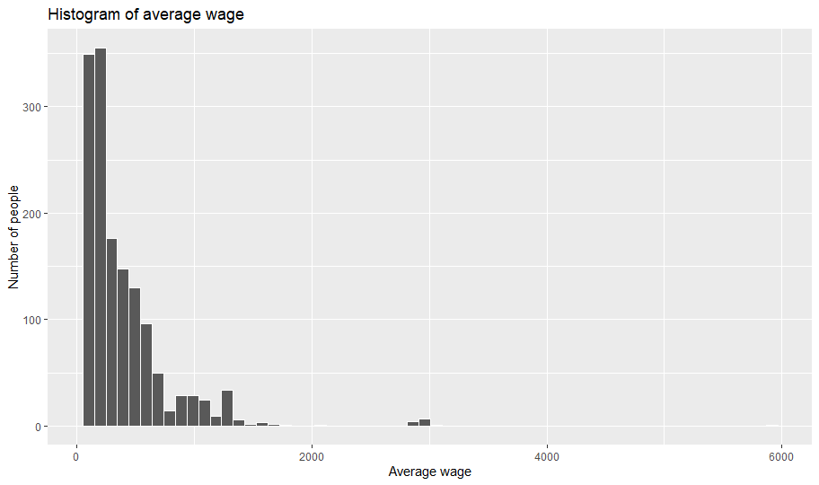
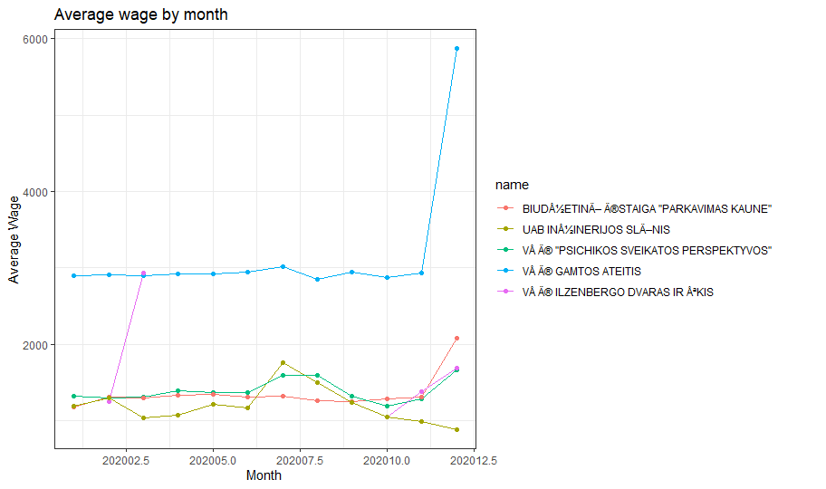
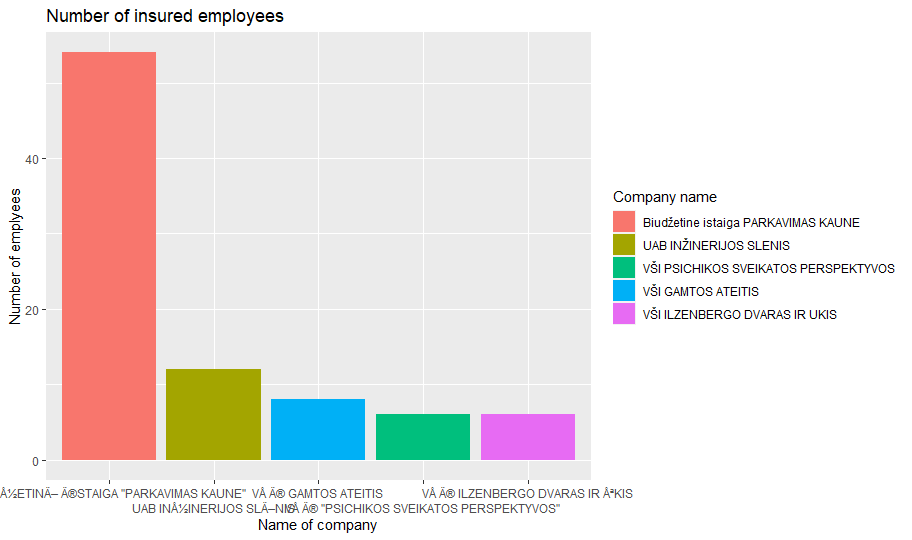
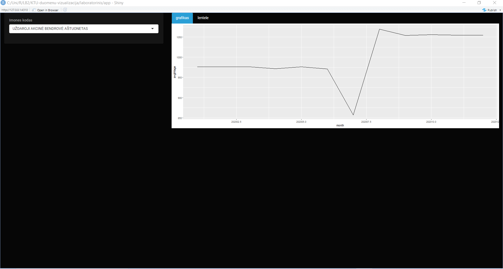

# R Laboratorinis darbas: duomenų vizualizacija

| Variantas | ecoActCode |
|------------- | ------------- |
|18   | 123456 |

test

### 1. Užduotis

Atsakymas:

Išvados: Iš histogramos matyti, jog atlyginima maždaug iki 700 gauna didžiausias kiekis žmonių. Maždaug nuo 500 iki 1200 gauna vidutiniškai žmonių šiose firmose, o didesni atlyginima nei 1200 gauna labai nedidelis kiekis žmonių.

### 2. Užduotis

Atsakymas:

Išvados: Iš visų įmonių didžiausia vidutinis atlyginimas yra įmonėje “VŠĮ GAMTOS ATEITIS”, likusiose įmonėse vidutinis atlyginimas maždaugg yra tarp 1000 ir 1500, tačiau kompanijoje “VŠĮ ILZENBERGO DVARAS IR ŪKIS” matomas staigus šuolis ir matosi, jog ne apie visus mėnesius turima informacija.  

### 3. Užduotis

Atsakymas:

Išvados: Iš brėžinio matyti, kad didžiausias skaičius apdraustų žmonių yra biudžetinėje įmonėje “PARKAVIMAS KAUNE”, truputis daugiau nei 10 apdraustų žmonių yra įmonėje “UAB INŽINERIJOS SLĖNIS”, po tiek pat apdraustų darbuotojų yra “VŠĮ PSICHIKOS SVEIKATOS PERSPEKTYVOS” ir “VŠĮ ILZENBERGO DVARAS IR ŪKIS”.

### 4. Užduotis

Shiny R aplikacijos nuotrauka:

